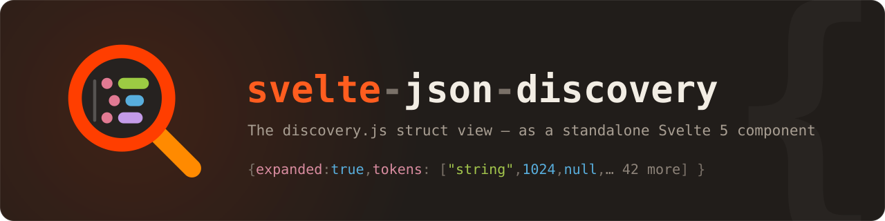

<p align="center">
  
</p>

<p align="center">
  <a href="https://www.npmjs.com/package/svelte-json-discovery"></a>
  <a href="https://github.com/Blackman99/svelte-json-discovery/actions/workflows/ci.yml"></a>
  <a href="./LICENSE"></a>
  <a href="https://blackman99.github.io/svelte-json-discovery/"></a>
</p>

# svelte-json-discovery

The interactive JSON tree — the **`struct` view** — from
[discoveryjs/discovery](https://github.com/discoveryjs/discovery),
extracted into a standalone, dependency-free **Svelte 5** component.

**[📖 Documentation & live examples →](https://blackman99.github.io/svelte-json-discovery/)**

## Quick start

```bash
pnpm add svelte-json-discovery
```

```svelte
<script>
    import { JsonViewer } from 'svelte-json-discovery';

    const data = { hello: 'world', numbers: [1, 2, 3] };
</script>

<JsonViewer {data} expanded={2} />
```

## Highlights

- 🎨 **Type-aware previews** — colored tokens for strings, numbers (with visual
  thousands separators), booleans, `null`, `Date`, `RegExp`, `Set`, `Error`,
  bigint, typed arrays, functions
- 🌳 **Expand / collapse** with configurable auto-expand depth and the original
  smart heuristics (number arrays and long strings stay collapsed)
- 📚 **Windowed large collections** — visible array indices and object values
  are read on demand; `Set`/`Map` iterators advance incrementally
- ✂️ **Long string handling** — truncation, length badges, escaped view with an
  "as text" toggle, URL auto-linking
- 🔍 **Global search** — cancellable key/value traversal, capped result counts,
  wraparound navigation and automatic reveal; legacy match highlighting remains
- 🎛️ **Controlled paths and controller methods** — expand, collapse, focus,
  scroll, select and navigate matches through application state or `bind:this`
- 🧭 **Optional Inspector shell** — import an accessible controlled view toolbar
  from `svelte-json-discovery/inspector` without adding it to the main entry graph
- 📄 **Safe asynchronous Raw view** — cooperatively format and copy only complete
  JSON-compatible values, with path diagnostics, cancellation and a byte cap
- 📊 **Configurable object-array Table** — automatic or controlled columns,
  compact/custom cells, shared paths, bounded Show more rendering and explicit
  current-window vs host-controlled full-data sorting
- ↔️ **Safe bounded Diff** — explicit baselines, host-supplied ChangeSets or
  transient previous-identity update highlights,
  entity-aware array moves, Date/RegExp/Map/Set semantics, cycle and hostile
  value protection, accessible markers, cancellation and configurable caps
- ✅ **Validation workflows** — precomputed or cancellable async issues,
  accessible summaries, Tree/Table markers, path navigation and optional
  Ajv, Zod and Valibot adapters
- 📋 **Value actions** — copy JavaScript path, RFC 6901 JSON Pointer, or
  formatted/compact JSON (with byte
  sizes and circular-structure detection), string copy variants
- 🛡️ **Safe inspection** — circular references and hostile getters, Proxies or
  iterators stay local to the affected node
- ⌨️ **Accessible ARIA tree** — roving focus, full direction-key navigation,
  Home/End, typeahead, Enter selection and Space expansion
- 🧾 **Field docs via JSON Schema** — hover a documented key to see its
  title, description, type, enum, default and deprecation status
- 🌗 **Light / dark / auto themes**, honoring `--discovery-fmt-*` CSS variables

See the full prop reference in the
[package README](./packages/svelte-json-discovery/README.md) or the
[docs site](https://blackman99.github.io/svelte-json-discovery/#api).

## Monorepo layout

| Path | Description |
| --- | --- |
| [`packages/svelte-json-discovery`](./packages/svelte-json-discovery) | The published component library |
| [`docs`](./docs) | Documentation site — consumes the library through the pnpm workspace, so the examples run the exact code that ships to npm |

## Development

```bash
pnpm install
pnpm dev          # library in watch mode + docs dev server
pnpm test         # Vitest + Testing Library public-behavior tests
pnpm check        # svelte-check across the workspace
pnpm lint         # eslint (@antfu/eslint-config); `pnpm lint:fix` to autofix
pnpm build        # build library + docs
pnpm deps:check   # preview dependency updates (taze)
pnpm deps:update  # apply dependency updates and reinstall
```

Minor/patch dependency bumps are also PR'd automatically every Monday by the
`update-deps` workflow ([taze](https://github.com/antfu-collective/taze)).

## Releasing

Versioning is managed with [changesets](https://github.com/changesets/changesets):

```bash
pnpm changeset    # describe your change, pick a bump
```

Merging to `main` lets the release workflow open a "chore: release" PR;
merging that PR publishes to npm (requires the `NPM_TOKEN` repo secret).

## Credits

All rendering logic, styling and UX derive from
[discoveryjs/discovery](https://github.com/discoveryjs/discovery)
(`src/views/struct/`) by [Roman Dvornov](https://github.com/lahmatiy) and
contributors. This project re-implements that view as a Svelte 5 component.

## License

[MIT](./LICENSE)
