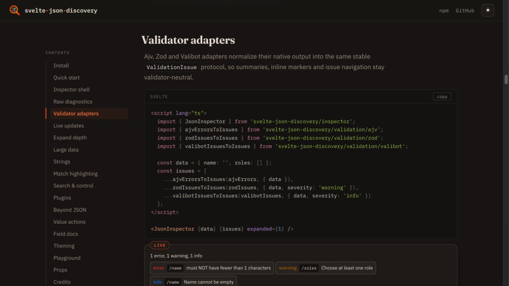
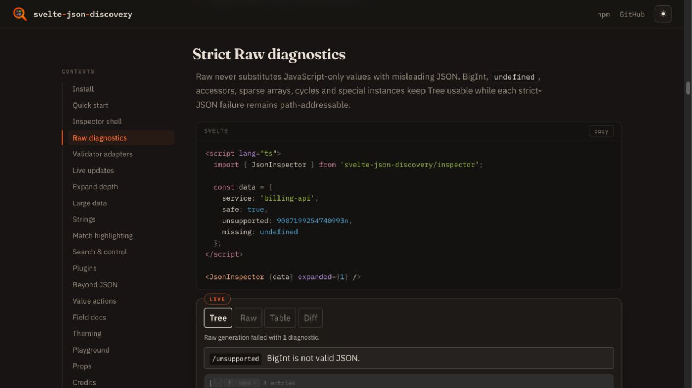
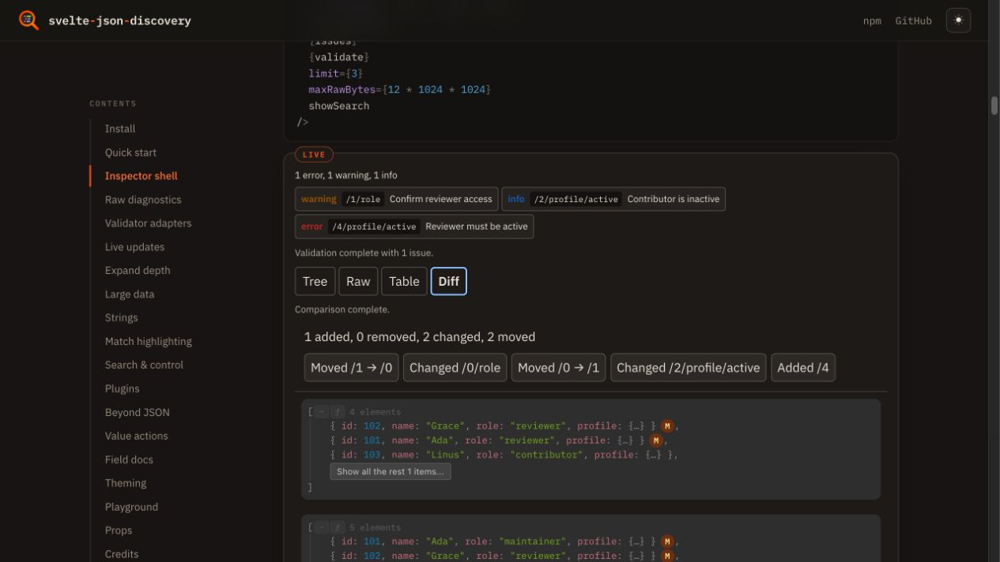
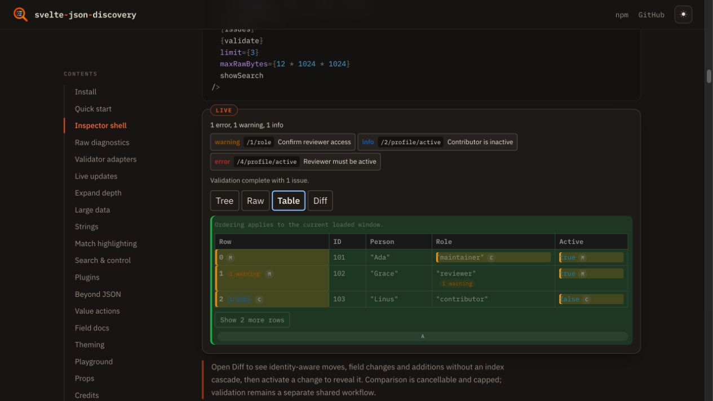
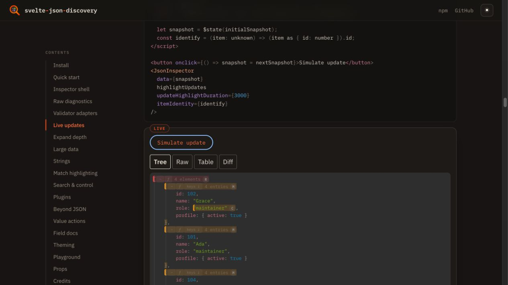
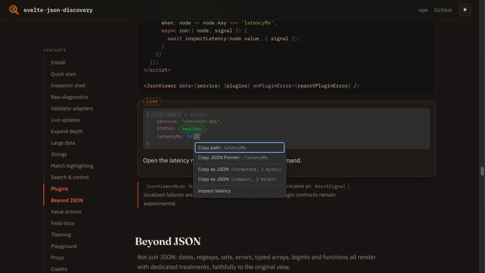

# JsonInspector release visual evidence

Reviewed on 2026-08-27 against the local production documentation UI. The
browser console reported no errors or warnings.

The review covered:

- controlled Table presentation and the loaded-window boundary;
- explicit Diff counts, moved/changed/added markers and both value panes;
- automatic update highlighting after replacing the data identity;
- plugin action discovery and menu placement on a matching node;
- strict Raw disabled state and its path-addressable BigInt diagnostic;
- Ajv, Zod and Valibot issues in one severity summary with Tree markers.

## Screenshots

### Validator adapters

### Strict Raw diagnostics

### Explicit Diff

### Controlled Table

### Automatic update highlighting

### Plugin action

